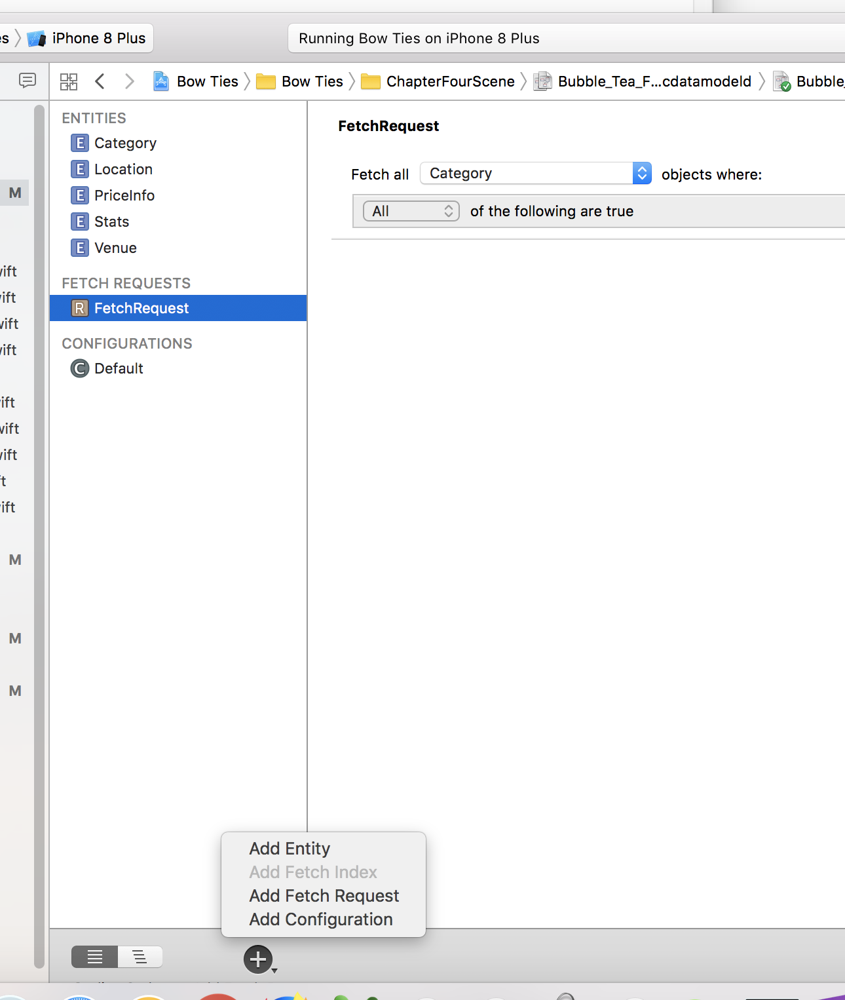

# Core_Data_DNG

学习 Core Data

<ul>

<li>
NSManagedObjectModel

</li>

<li>
NSPersistentStore

</li>

<li>
NSPersistentStoreCoordinator

</li>

<li>
NSManagedObjectContext

<table>
<tr>
<th>
inverse relationship handling

</th>

</tr>

</table>

</li>

<li>
NSPersistentContainer

</li>
</ul>

## Notes One:

> // MARK: - Properties
> var managedContext: NSManagedObjectContext!

To reiterate, before you can do anything in Core Data, you first have to get an NSManagedObjectContext to work with. Knowing how to propagate a managed object context to different parts of your app is an important aspect of Core Data programming.

## Notes Two: 

### Visualizing , Chapter 3

The graph editor style is a great tool to visualize the relationships between your Core Data entities. Here the to-many relationship from Dog to Walk is represented with a double arrow. Walk points back to Dog with a single arrow, indicating a to-one relationship.
Feel free to switch back and forth between the two editor styles. You might find it easier to use the table style to add and remove entities and attributes, and the graph style to see the big picture of your data model.

## Notes Three:

> As you can see, the Core Data version of this method is much more complicated. First, you have to create a new Walk entity and set its date attribute to now. Next, you have to insert this walk into the currently selected dog’s list of walks.

> However, the walks attribute is of type NSOrderedSet. NSOrderedSet is immutable, so you first have to create a mutable copy (NSMutableOrderedSet), insert the new walk and then reset an immutable copy of this mutable ordered set back on the dog.

> Note: Is adding a new object into a to-many relationship making your head spin? Many people can sympathize, which is why Dog+CoreDataProperties contains generated accessors to the walks ordered set that will handle all of this for you.

> For example, you can replace the entire if-let statement in the last code snippet with the following:
> currentDog?.addToWalks(walk)

> Give it a try!

### Convert

> /* if let dog = currentDog, let walks = dog.walks?.mutableCopy() as?    NSMutableOrderedSet {

> **            walks.add( walk)

> **          dog.walks = walks

> **                do{

> **                   try managedContext.save()

> **                }catch let error as NSError{

> **                    print("Save error: \(error), description: \(error.userInfo)")

> **                }

> }*/

### to

> currentDog?.addToWalks(walk)

> tableView.reloadData()

## 代码简化的， 丧心病狂， Core Data

## Notes Four:

> Note: Deletion used to be one of the most "dangerous" Core Data operations. Why is this? When you remove something from Core Data you have to delete both the record on disk as well as any outstanding references in code.

> Trying to access an NSManagedObject that had no Core Data backing store resulted in the the much-feared inaccessible fault Core Data crash.

> Starting with iOS 9, deletion is safer than ever. Apple introduced the property shouldDeleteInaccessibleFaults on NSManagedObjectContext, which is turned on by default. This marks bad faults as deleted and treats missing data as NULL/nil/0.

# Chapter 4: Intermediate Fetching

* Fetch only what you need to
* Refine your fetched results using predicates
* Fetch in the background to avoid blocking the UI
* Avoid unnecessary fetching by updating objects directly in the persistent store

### NSFetchRequest: the star of the show

# Chapter 4:  Visual Panel Tip

Open Bubble_Tea_Finder.xcdatamodeld and long-click the Add Entity button:

> 长按就出来啦

Select Add Fetch Request from the menu. This will create a new fetch request on the left-side bar and take you to a special fetch request editor:

> Note: You can click on the newly created fetch request on the left-hand sidebar to change its name.

You can make your fetch request as general or as specific as you want using the visual tool in Xcode’s data model editor. To start, create a fetch request that retrieves all Venue objects from the persistent store.

## Git 操作 :

> git push git@dengV:dengV/Core_Data_DNG.git
